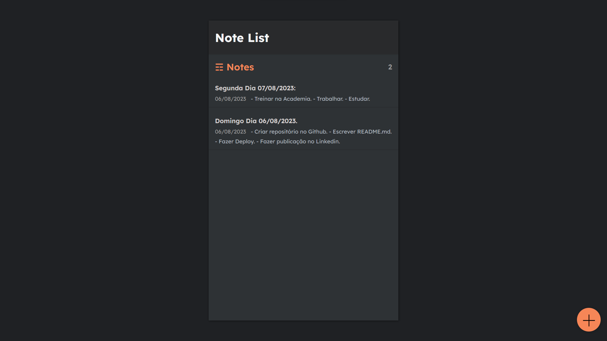

# React-Django Notes Integration Project

This README provides an overview of a project that demonstrates the integration between React and Django for building a notes application. Please note that this project is not owned by me; it is based on a tutorial from a YouTube channel. I completed this project solely for the purpose of practicing backend and frontend integration as part of the tutorial.

# Main Page



## Project Overview

The React-Django Notes Integration Project showcases the process of integrating a frontend React application with a backend Django API. The goal is to create a functional notes application that allows users to manage and organize their notes effectively.

### Technologies Used

- React JS
- Django
- Django REST Framework

## Getting Started

To run this project locally, you can follow these steps:

1. Clone the tutorial repository from GitHub:

    ```
    git clone https://github.com/samuerikcoder/NotesApp---React-Django.git
    ```

2. Navigate to the project directory:

    ```
    cd NotesApp
    ```

3. Set up the backend:


   - Activate your existing virtual environment:

     ```
     venv/bin/activate  # On Windows, use: venv\Scripts\activate
     ```

   - Apply the migrations:

     ```
     cd mynotes
     python manage.py migrate
     ```

   - Start the Django development server:

     ```
     python manage.py runserver
     ```

4. Set up the frontend:

   - Navigate to the `frontend` directory:

     ```
     cd ..  # if you were in the mynotes folder
     cd frontend
     ```

   - Start the React development server:

     ```
     npm start
     ```

5. Open your web browser and go to `http://localhost:3000` or go to the package.json and modify the proxy property to access the React frontend. You should now be able to interact with the notes application, which communicates with the integrated Django backend.

## Contributing

As this project is based on a tutorial, and I am not the original author, I am unable to accept contributions. However, if you have suggestions or improvements related to the integration between React and Django, I encourage you to engage with the tutorial's original repository and community.

## Credits

This project is based on a tutorial created by [Dennis Ivy](https://www.youtube.com/@DennisIvy). The integration of React and Django was completed by me for educational purposes, following the guidance provided in the tutorial.

## License

This project is provided for educational purposes and all copyrights belong to [Dennis Ivy](https://www.youtube.com/@DennisIvy).
